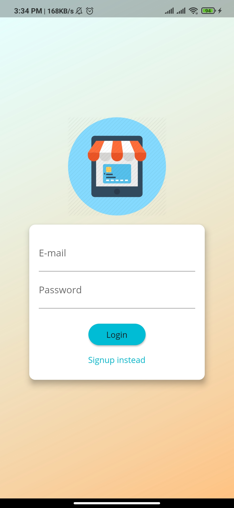
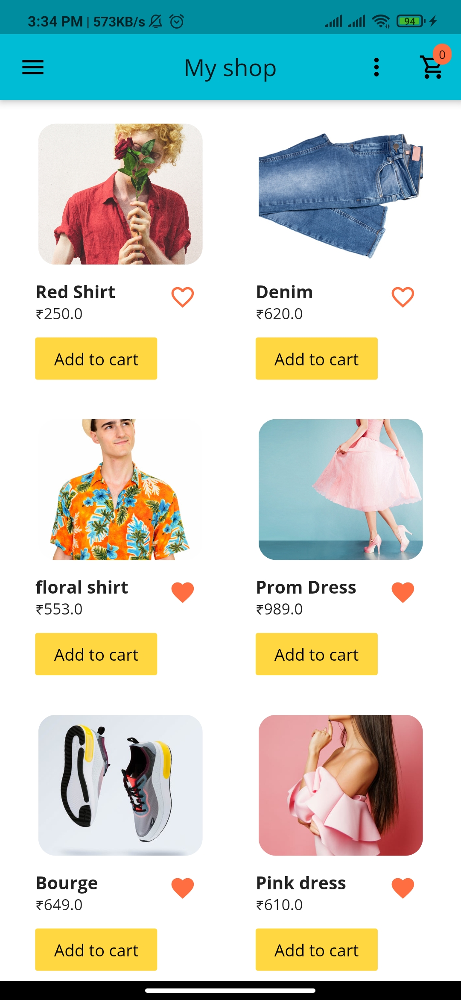
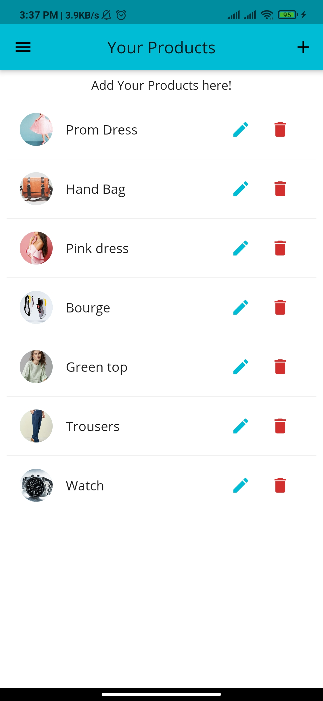
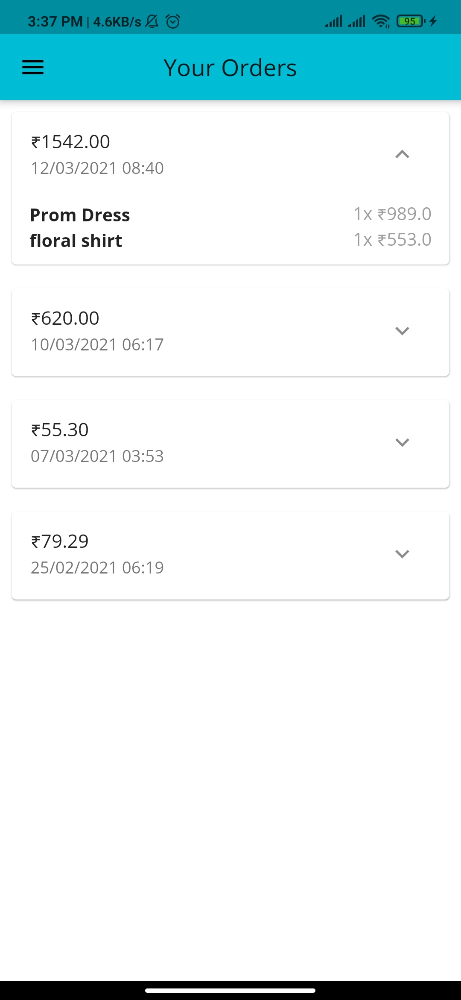
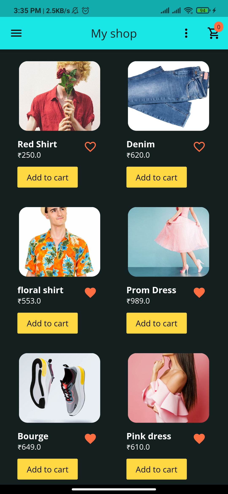
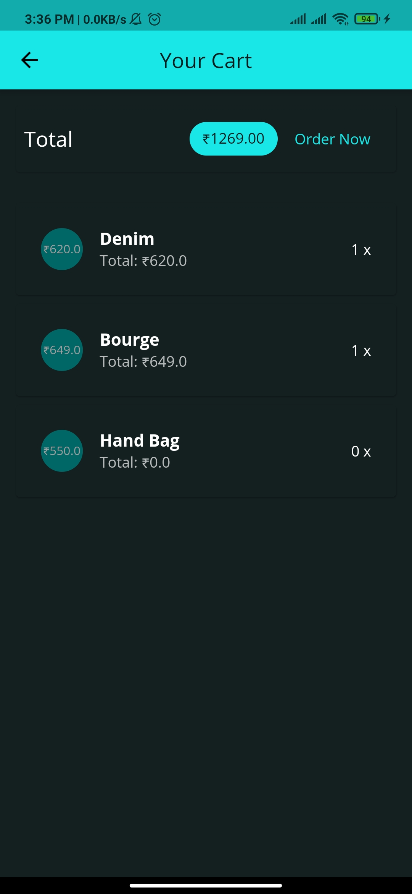

# shop_app

## Made this app to explore how flutter works.

This app covers following core concepts of flutter : 

> State management using provider package

> Connecting backend using http package

> Token based Authentication

> On Device storage using shared preferences

> Scoping data to users

> Adding user interaction

> Animations in flutter

### Short overview of app [here](https://drive.google.com/file/d/1bJ4HLH_ty7bjiuOFLvThZiFVuqcfZBCu/view?usp=sharing)

 &nbsp; &nbsp;  &nbsp; &nbsp; 

 &nbsp; &nbsp;  &nbsp; &nbsp; 
